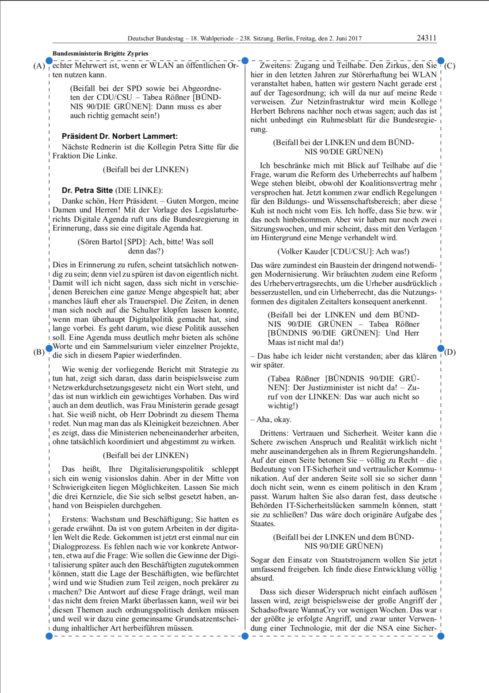
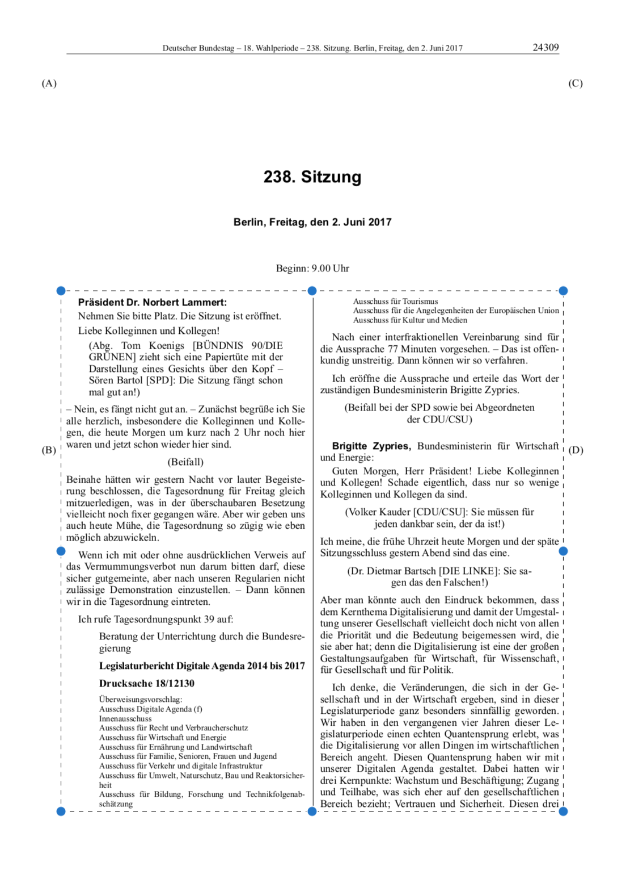
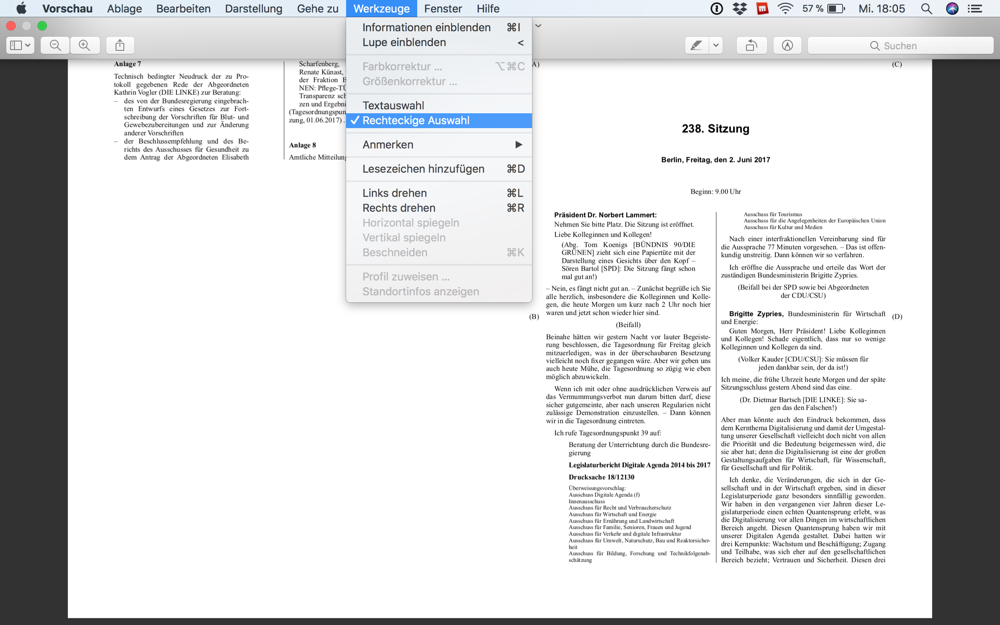
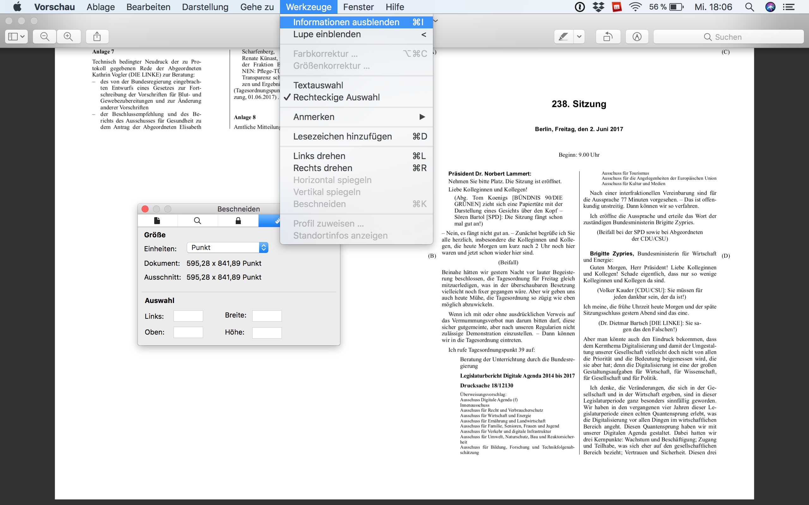
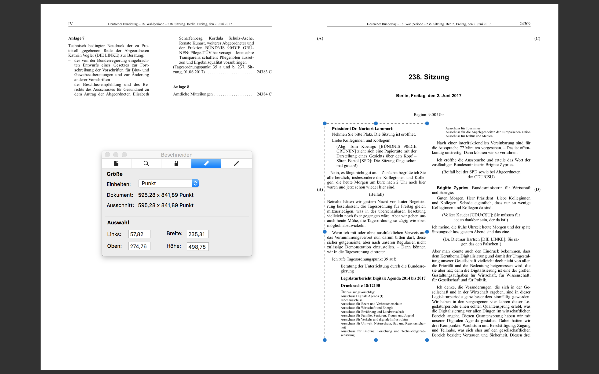

```{r setup, include=FALSE}
knitr::opts_chunk$set(echo = TRUE)
```

# Aim: Easing the pain pdf can cause

Many documents are available in a pdf format. There are many reasons why data scientists would want to convert pdf into XML as a semi-structured data format. Liberating text from the pdf prison
is the first step to further process text in a Natural Language Processing (NLP) pipeline, or to analyse it directly. To support this rather technical step, R users can use a couple of packages to extract text from pdf documents, in particular [Rpoppler](), or [pdftools](). However, if you deal with somewhat or more heavily layouted document, the real work starts after text extraction. To get rid of unwanted features resulting from document layout, manual cleaning, batteries of regular expressions and several further programming quirks may be necessary to get the postprocessing task done.

The idea of the trickypdf package is to proactively deal with the layout of a document and to extract
the text as cleanly as possible, to obviate the need for nerve-wrecking postprocessing.


## Some sample scenarios

```{r load_trickypdf}
library(trickypdf)
```


### Scenario: A two column pdf, a table of contents to skip

A typical scenario is that you have a pdf document with a two-column layout, with a front matter and/or a table of contents at the beginning of the document that you do not want to be part of the document that you process. As an example for this typical scenario, the package includes a protocol of the German Bundestag, the protocol of the 238th session of the 18th Bundestag.

```{r inspect_protocol}
plenaryprotocol <- system.file(package = "trickypdf", "extdata", "pdf", "18238.pdf")
if (interactive()) browseURL(plenaryprotocol)
```

For the pages with the debates and speeches, we will define boxes from which the text shall be extracted. Yet the first step is to identify the the page with the beginning of the actual debate. Looking at the pdf, there is one defining feature of this feature of the page: "Beginn: 9.00 Uhr". And: "(Schluss: 15.10 Uhr)".

```{r detect_beginning_end}
P <- PDF$new(filename_pdf = plenaryprotocol)

P$get_text_from_pages(paragraphs = FALSE)

regexStartDebate <- "^\\s*Beginn:\\s+\\d{1,2}\\s*(\\.|:)\\s*\\d{1,2}\\s+Uhr\\s*$"
regexEndDebate <- "^\\s*\\(Schluss:\\s+\\d{1,2}\\s*(\\.|:)\\s*\\d{1,2}\\s+Uhr\\)\\s*$"

pageStartDebate <- P$find(regex = regexStartDebate)
pageEndDebate <- P$find(regex = regexEndDebate)
```

Having identified where the body of the debate starts, and where it ends, we re-instantiate the PDF class, but with the identified start and end pages.


```{r}
P$drop_page(page = (pageEndDebate + 1):P$no_pages)
P$drop_page(page = 1:(pageStartDebate - 1))
```


#### Procedure 1: Get text from defined boxes

We can use Apple's Preview tool or `tabulizer::???` to identify the coordinates of the boxes with left and right columns (see Annex). When we set page to NULL (the default), we make the definition for all pages.
 
```{r add_box_all_pages}
P$add_box(box = c(left = 60, width = 235, top = 70, height = 703), page = NULL, replace = TRUE)
P$add_box(box = c(left = 301, width = 235, top = 70, height = 703), page = NULL, replace = FALSE)
```

To inspect the result, see `P$boxes`. You will see that the coordinates in the resulting data.frame are not the input values: Recalibrating coordinates to the pixel format is automatically performed.

The layout of the first page is different, there is a header with relevant metadata, but we do not want it to be part of the text of the debate we extract. So we use the `$add_box()`-method again, but we explicitly state the page number. [it is one, not 5 - explain!]

```{r add_box_page_1}
P$add_box(box = c(left = 58, width = 235, top = 277, height = 493), page = 1, replace = TRUE)
P$add_box(box = c(left = 301, width = 235, top = 277, height = 493), page = 1, replace = FALSE)
```

The PDF class is now appropriately configured. We instruct the PDF class to iterate through all boxes that have been defined and to get the text within these boxes.

```{r}
P$get_text_from_boxes(paragraphs = TRUE)
```

The result is stored as a list in the field \code{pages}. In this case, each element in the list is itself a list with the content of a box. You can see this, for instance, by typing `P$pages[[1]]`.

The justification of the text in the columns will lead to several surplus whitespaces. We remove it using the method `$purge()`.

```{r}
P$purge()
```

To inspect the result, we re-xmlify the text, which will create a very simply xml in the field \code{xml}. We can turn this into a simple html document.

```{r}
P$xmlify()
P$xml2html()
if (interactive()) P$browse()
```

Assuming that we want a plain text document as output, we turn the list in the field `$pages` into a plain character vector that can be saved to disk.

```{r}
txt <- unname(unlist(P$pages))
destfile <- tempfile()
writeLines(text = txt, con = destfile)
```


#### Approach 2

The second approach for handling a two column layout with unwanted content on the margins will involve two steps. First, we define boxes with wanted content. Second, we remove anything that is external to these boxes. Third, we do away with the two column layout. 

However, somewhat different from the first approach, the boxes just define an area with wanted content. They do not need to capture the layout in a lot of detail. So you just define one box per page. 

```{r screenshot_one_box_1, out.width = "500px", dpi = 120, echo = FALSE}

```

To learn how to get the coordinates of the box, see the Annex. If we leave the parameter page of the `$add_box`-method undefined, the definition of a box will be applied to all pages.

```{r}
P$add_box(box = c(left = 60, width = 475, top = 72, height = 702), replace = TRUE)
```

However, the layout of the first page is somewhat different. Some metadata are given first.

```{r screenshot_one_box_2, out.width = "500px", dpi = 120, echo = FALSE}

```

So we define a different box for the first page we process.

```{r}
P$add_box(box = c(left = 58, width = 476, top = 273, height = 496), page = 1, replace = TRUE)
```

The next step now is to remove everything from the pages -- the xml of the pdf document -- that is not within one of the boxes that we have defined.

```{r remove_unboxed_text}
P$remove_unboxed_text_from_all_pages()
```

Marginalia, column titles and page numbers have now been removed. So it is not necessary to remove these things in a postprocessing step.

We will dissolve the two column layout using the `$decolumnize()`-method: It rearranges the text on the pages by identifying what is to the right side of the middle of the page and moves it to the bottom of the page. To cope with crooked scans, the (integer) value in the field `$deviation` can be set, to allow for (small) deviations from the center line.

```{r decolumnize}
P$deviation <- 10L
P$decolumnize()
```

Let us get the result from the pages.

```{r get_text}
P$get_text_from_pages(paragraphs = FALSE)
```

A small post-processing step: We remove unwanted whitespace.

```{r purge}
P$purge() # cleaning
```

The result is in the slot `$pages` of the class. We can re-create a simple XML using the `$xmlify` method (the result will be in the field `$xmlification`). This XMLification can be inspected as HTML.

```{r inspect_xmlification}
P$xmlify()
P$xml2html()
if (interactive()) P$browse()
```

To save plain text to disc, the same logic of unlisting the content in the field `$page` as before applies.

```{r}
writeLines(
  text = unname(unlist(P$pages)),
  con = destfile2 <- tempfile()
  )
```

### Add previously undetected headlines

In some two column documents, there are headlines which span over both columns. Sometimes, one cannot define the location of these headlines in advance. For this purpose, a functionality was created to detect these lines and add boxes accordingly. The process is just as described above with one added line. We use a plenary protocol from Saxony to illustrate the method.

```{r}
plenaryprotocol_saxony <- system.file(package = "trickypdf", "extdata", "pdf", "SN_05_002.pdf")
if (interactive()) browseURL(plenaryprotocol_saxony)
```

If you look at the pdf document, you see three headlines which are distributed irregularly. 

```{r}

regexStartDebate <- "^\\s*\\(Beginn\\sder\\sSitzung:?\\s\\d{1,2}(:|\\.)\\d{1,2}\\sUhr\\)\\s*$" 
regexEndDebate <- "^\\s*\\((Schluss|Ende|Schluß)\\sder\\sSitzung:?\\s\\d{1,2}(:|\\.)\\d{1,2}\\sUhr\\)\\s*$" 

    P <- PDF$new(filename_pdf = plenaryprotocol_saxony) 
    P$jitter <- 10
    P$get_text_from_pages(paragraphs = FALSE) 


      pageStartDebate <- P$find(regex = regexStartDebate)
      pageEndDebate <- P$find(regex = regexEndDebate)

      P$drop_page(page = (pageEndDebate + 1):P$no_pages) 
      P$drop_page(page = 1:(pageStartDebate - 1))


  P$add_box(box = c(top = 68, height = 710, left = 54, width = 240), page = NULL, replace = TRUE)
  P$add_box(box = c(top = 68, height = 710, left = 300, width = 240), page = NULL, replace = FALSE)
  
```

After we declared these boxes, we add our headlines. 

```{r}
library(magrittr)
P$add_headline_boxes()
```

This process loops through every line of text and checks for lines which cross the middle of the page. It then concatenates these lines and recalculates the previously assigned boxes. With this step performed, we proceed like earlier.

```{r}
    P$get_text_from_boxes(paragraphs = FALSE)
    P$purge()
    plaintext <- unname(unlist(P$pages))
```

As we see, the headlines are detected nicely.

### Annex

```{r screenshot_preview1, out.width = "500px", dpi = 120, echo = FALSE}

```


```{r screenshot_preview2, out.width = "500px", dpi = 120, echo = FALSE}

```


```{r screenshot_preview3, out.width = "500px", dpi = 120, echo = FALSE}

```


